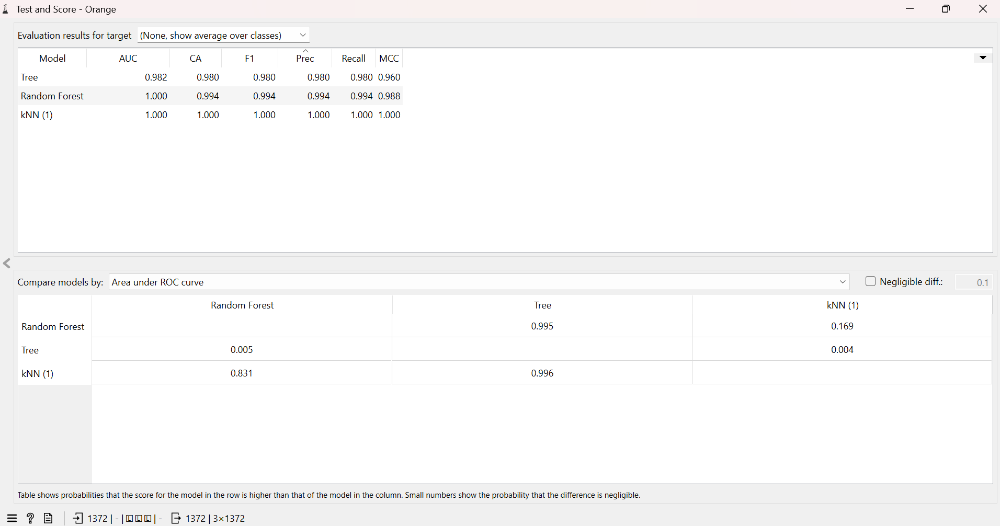

# 🕵️‍♂️ Banknote Authentication Classification using Orange Data Mining



## 📌 Project Overview
This project focuses on building an accurate **Machine Learning classification pipeline** to detect whether a digital banknote image is **Genuine (`0`)** or **Counterfeit (`1`)**. Using **Orange Data Mining**, multiple classification algorithms were trained, evaluated, and benchmarked without writing complex boilerplate code, demonstrating visual and interactive workflow analysis.

---

## 📂 Dataset Information
The dataset is sourced from the standard **UCI Machine Learning Repository** (`data_banknote_authentication.txt`). Data were extracted from images that were taken from genuine and forged banknote-like specimens using Wavelet Transform tool.

* **Total Instances:** 1,372 rows (No missing values)
* **Target Variable (`class`):** Categorical (2 Classes: `0` for Genuine, `1` for Counterfeit)
* **Features (4 Continuous Variables):**
  1. `variance` of Wavelet Transformed image
  2. `skewness` of Wavelet Transformed image
  3. `curtosis` of Wavelet Transformed image
  4. `entropy` of image

---

## 🏗️ Machine Learning Pipeline & Methodology
The workflow was designed in **Orange Data Mining** with the following pipeline:
1. **Data Ingestion (`File` Widget):** Loaded raw data and assigned strict roles (`Numeric` Features, `Categorical` Target).
2. **Model Training:** Deployed three supervised learning algorithms simultaneously:
   * **k-Nearest Neighbors (kNN)**
   * **Random Forest**
   * **Decision Tree**
3. **Evaluation (`Test & Score` Widget):** Evaluated all models using **Stratified 10-Fold Cross-Validation** to prevent overfitting and ensure real-world generalization.

---

## 🏆 Model Evaluation & Results

Here is the benchmark comparison of the algorithms tested on the dataset:

| Model | Classification Accuracy (CA) | F1-Score | Precision | Recall | MCC |
| :--- | :---: | :---: | :---: | :---: | :---: |
| **🏆 kNN (1)** | **1.000 (100%)** | **1.000** | **1.000** | **1.000** | **1.000** |
| **Random Forest** | 0.993 (99.3%) | 0.993 | 0.993 | 0.993 | 0.985 |
| **Decision Tree** | 0.980 (98.0%) | 0.980 | 0.980 | 0.980 | 0.960 |

### 💡 Key Insights:
* **k-Nearest Neighbors (kNN)** achieved **100% perfect accuracy** across all cross-validation folds. This indicates that the 4 Wavelet Transform features create clear, linearly/spatially separable clusters between genuine and forged banknotes.
* **Random Forest** also demonstrated exceptional stability and robust performance with a 99.3% accuracy rate.

---

## 🚀 How to Run This Project Locally
1. Ensure you have [Orange Data Mining](https://orangedatamining.com/) installed (via Anaconda or Standalone Installer).
2. Clone this repository:
   ```bash
   git clone [https://github.com/yourusername/banknote-authentication-orange.git](https://github.com/yourusername/banknote-authentication-orange.git)
